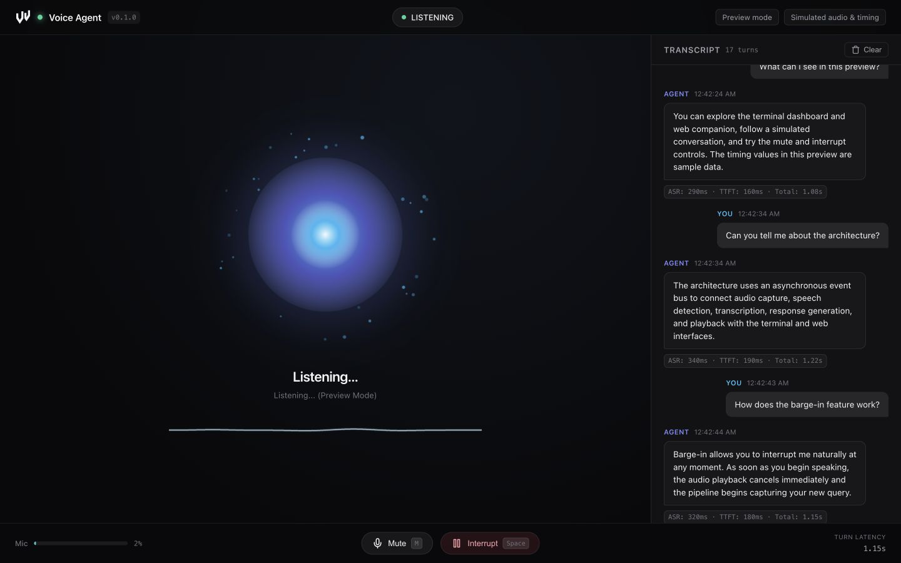

<p align="center"></p>

<p align="center">Speech, responses, and interruption in one loop.</p>

[](https://github.com/natelindev/voice-agent/actions/workflows/ci.yml)
[Documentation](https://natelindev-voice-agent.pages.dev/) · [Contributing](CONTRIBUTING.md) · [Report a bug](https://github.com/natelindev/voice-agent/issues/new/choose)

Voice Agent is a Python voice assistant for your workspace. Local voice-activity detection feeds an asynchronous transcription, response, and speech pipeline. A terminal dashboard and optional browser companion show state, transcripts, audio levels, and per-turn timing.



*Actual application preview. Conversation, audio levels, and latency values are simulated.*

## Try the interface

Requires **Python 3.11+** and [uv](https://docs.astral.sh/uv/). Preview needs no API key, audio device, or speech-model download. Tests and live audio imports need PortAudio: on Ubuntu/Debian install `libportaudio2` with your package manager; on macOS use `brew install portaudio`.

```sh
git clone https://github.com/natelindev/voice-agent.git
cd voice-agent
uv sync --locked
uv run voice-agent --demo --web
```

The terminal dashboard appears when stdout is a TTY. The companion opens at <http://127.0.0.1:8000>; use `--no-open` to leave browser launching to you. Audio capture/playback happen in the host Python process, rather than in the browser.

## Runtime modes

| Mode | Recognition & speech | Responses | Requirements |
| --- | --- | --- | --- |
| API | Local Silero VAD; Whisper API; streamed OpenAI TTS | Streaming OpenAI chat | API key, PortAudio, microphone and speaker |
| Mac speech + Codex | Local whisper.cpp; macOS `say` | Authenticated Codex CLI | macOS, whisper.cpp model/tools, Codex access and network |
| Preview | Simulated turns and audio levels | Fixed sample conversation | No live services or microphone |

### Live API mode

Install PortAudio for your OS and allow microphone access to your terminal. On macOS:

```sh
brew install portaudio
cp .env.example .env
# Edit .env and set OPENAI_API_KEY
uv run voice-agent --web
```

API mode currently uses `whisper-1`, `gpt-4o-mini`, and `gpt-4o-mini-tts` with the coral voice. Utterance audio, conversation text, and synthesized response text are sent to the relevant API stages; usage is billed by the provider. Keep `.env` private.

### Mac speech + Codex

```sh
uv run voice-agent --local --web
```

Requires an authenticated `codex` executable, macOS `say`, whisper.cpp's `whisper-server` / `whisper-cli`, and the expected OpenSuperWhisper model. See [backend setup](https://natelindev-voice-agent.pages.dev/#modes) for the exact model path and inference endpoint.

**Speech runs locally; Codex responses use a network service.** This mode does not require an OpenAI developer API key, but it is not fully offline and remains subject to the Codex account's access and limits. Without an API key, the CLI selects this backend by default; use `--demo` explicitly for a preview.

## Interruption and echo handling

Default speaker mode suppresses microphone input during playback and a 500 ms echo-drain window, and filters recognized speaker bleed. Press **Space** or click **Interrupt** to stop a response manually. Use headphones before enabling voice-triggered interruption during playback:

```sh
uv run voice-agent --web --headphones
```

The web controls also offer **M / Mute** and **R / Clear**. Press **Ctrl+C** to stop the process. The companion binds to loopback and has no built-in authentication; it is intended for local use.

## Pipeline

```text
Microphone → Silero VAD → utterance PCM → ASR → user text
  → response sentences → TTS PCM → speaker playback

EventHub → terminal dashboard + WebSocket companion
```

Capture uses 16 kHz mono float32 chunks; VAD emits int16 utterance PCM. Audio threads hand work to asyncio; cancellation stops playback and cancels the active response. Real latency depends on hardware and services. Preview timings are sample data, and no production latency guarantee is established here.

## CLI

| Option | Behavior |
| --- | --- |
| `--web`, `--port` | Start companion; default port 8000 |
| `--no-open` | Skip browser launch |
| `--headless` / `--no-tui` | Disable dashboard |
| `--local` | Mac speech + Codex; takes precedence over `--demo` |
| `--demo` | Simulated preview |
| `--headphones` | Allow mic-triggered interruption during playback |
| `--verbose` | Debug logs, which may contain transcript text |

## Development

```sh
uv sync --locked
uv run pytest tests/ -q
uv build
```

The [documentation](https://natelindev-voice-agent.pages.dev/) covers setup, audio contracts, backend behavior, controls, and troubleshooting. Tests use service mocks; live microphone-to-speaker behavior still needs verification on the target hardware. See [CONTRIBUTING.md](CONTRIBUTING.md) and [SECURITY.md](SECURITY.md).

## License

[MIT](LICENSE). [Brand assets](docs/assets/brand/README.md).
